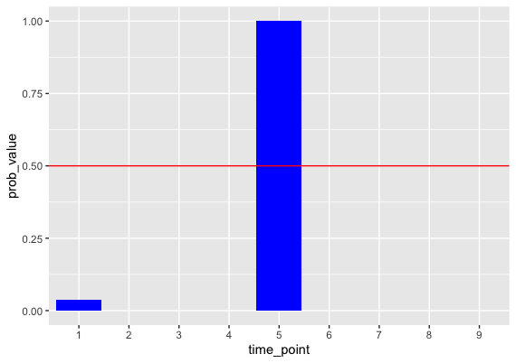
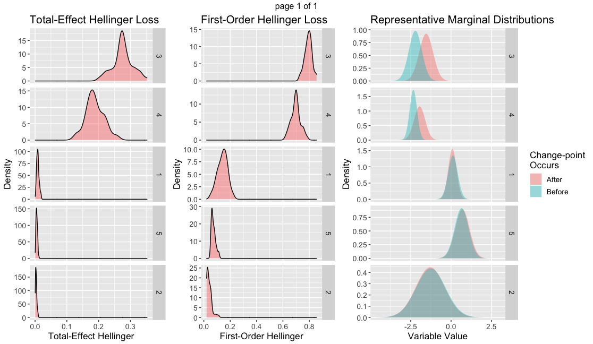

<div align="center">
</img>
</div>

# **bayesWatch** 
  
 

The main method `bayeswatch` of this package fits an array of Gaussian Graphical Mixture Models to groupings of homogeneous data in time, called regimes, which we model as the observed states of a Markov process with unknown transition probabilities.   While the primary goal of this model is to identify when there is a regime change, as this indicates a significant change in input data distribution, an attractive consequence of this approach is a rich collection of models fit to many different possible regimes.  A fault detection system that leverages these model fits to describe the cause of a regime change is included in `detect_faults`.  For further technical details on these methods, see the Citations section.

This repository is organized as a stand-alone R package.  For questions, issues, or clarifications please reach out to Murph: <acmurph@unc.edu>.  Feel free to email any applications; we'd be happy to highlight them here.

## Installation

You can install the latest version from CRAN using:

``` r
install.packages("bayesWatch")
```

``` r
require(bayesWatch)
```

## Examples
Simulated data are available with a change-point imposed after day 5.  This change-point only occurs for variables 3 and 4, with 4 seeing the more significant change.
```r
data("full_data")
data("day_of_observations")
data("day_dts")

my_fit       = bayeswatch(full_data, day_of_observations, day_dts, 
                            iterations = 500, g.prior = 1, linger_parameter = 20, n.cores=3,
                            wishart_df_inital = 3, hyperprior_b = 3, lambda = 5)
                            MCMC chain running...
# 5->10->15->20->25->30->35->40->45->50->55->60->65->70->75->80->85->90->95->100
# [1] "MCMC sampling complete.  Performing fault detection calculations..."

print(my_fit)
#      bayesWatch object
# ----------------------------------
#   Time-point Change-point probability
# 1          1                        0
# 2          2                        0
# 3          3                        0
# 4          4                        0
# 5          5                        1
# 6          6                        0
# 7          7                        0
# 8          8                        0
# 9          9                        0
```
```r
plot(my_fit)
```
<!-- -->

Once the regime vector is fit, we can print out the fault detection graphs.
```r
detect_faults(my_fit)
```
<!-- -->


## Packages Required

None.

## Citation

Coming soon!